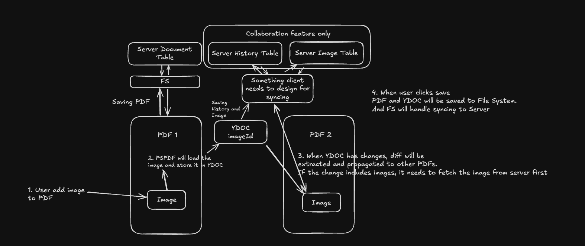

## Demo


## App flow


## Install bun
```
brew install oven-sh/bun/bun
```

## Install packages
```
bun i
```

## Copy pspdfkit to public folder
```
cp -R ./node_modules/pspdfkit/dist/ ./public
```

## Run Client
```
bun dev
```

## Run Images and History Server
```
node server/server.js
```

## RunWebRTC Server
```
PORT=4444 node node_modules/y-webrtc/bin/server.js
```

## Document
- https://github.com/yjs/yjs
- https://github.com/yjs/y-webrtc
- https://www.nutrient.io/guides/web/annotations/introduction-to-annotations/what-are-annotations/
